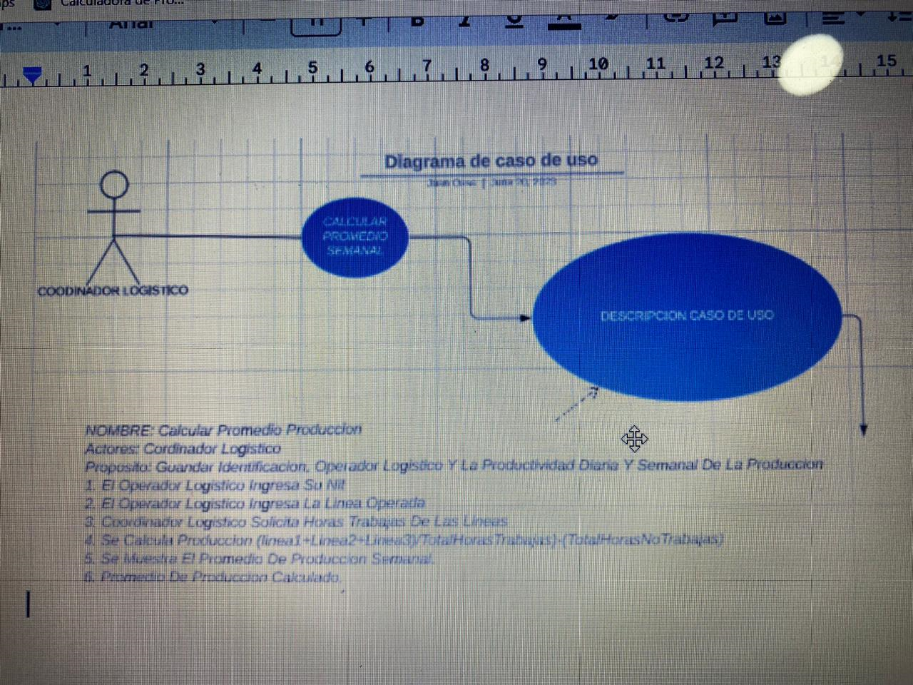
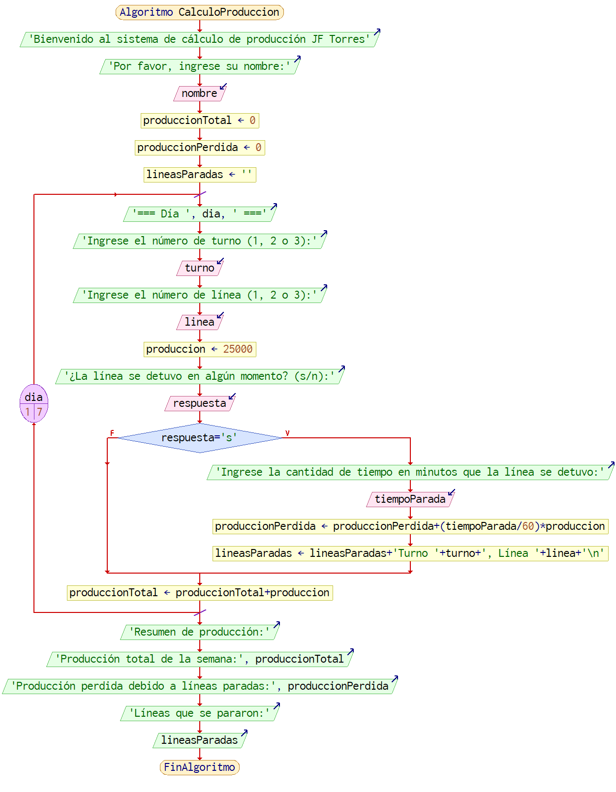

## **ESTE ES MI PROYECTO DE LOGISTICA**
------------------------------------------------------------------------------------------------------------------------------------------
------------------------------------------------------------------------------------------------------------------------------------------
En su labor como programador de software ha sido elegido para el desarrollo de una aplicación que
necesita un coordinador logistico de una planta de producción, que desea calcular la cantidad de cajas en las lineas de produccion en diferentes turnos.

La Produccion se divide en 3 turnos; turno 1= 6am a 2pm, turno 2= 2pm a 10pm, turno 3= 10pm a 6am. Cada linea de produccion por turno produce 25.000 cajas de manera continua.

Solicitar nombre de la persona a cargo, turno realizado y que linea trabajó

Solicitar informacion si se paro en algun momento la linea, cual linea, por cuanto tiempo se paro y hacer respectivo ajuste, finalmente calcular y mostrar en pantalla que lineas se pararon con su produccion perdida y total de produccion de una semana.

-----------------------------------------------------------------------------------------------------------------------------------------
-----------------------------------------------------------------------------------------------------------------------------------------

-----------------------------------------------------------------------------------------------------------------------------------------
-----------------------------------------------------------------------------------------------------------------------------------------

-----------------------------------------------------------------------------------------------------------------------------------------
-----------------------------------------------------------------------------------------------------------------------------------------

------------------------------------------------------------------------------------------------------------------------------------------
------------------------------------------------------------------------------------------------------------------------------------------
**Algoritmo CalculoProduccion**
	// aqui la informacion la pone el operario
	*Escribir 'Bienvenido al sistema de cálculo de producción JF Torres'
	Escribir 'Por favor, ingrese su nombre:'
	Leer nombre
	// variables 
	produccionTotal <- 0
	produccionPerdida <- 0
	lineasParadas <- ''
	// empieza a rellenar el campo los operarios 
	Para dia<-1 Hasta 7 Hacer
		Escribir '=== Día ', dia, ' ==='
		// se solicita info del turno
		Escribir 'Ingrese el número de turno (1, 2 o 3):'
		Leer turno
		Escribir 'Ingrese el número de línea (1, 2 o 3):'
		Leer linea
		// aqui se calcula la produccion del turno actual
		produccion <- 25000
		// preguntar si se paro la linea 
		Escribir '¿La línea se detuvo en algún momento? (s/n):'
		Leer respuesta
		Si respuesta='s' Entonces
			Escribir 'Ingrese la cantidad de tiempo en minutos que la línea se detuvo:'
			Leer tiempoParada
			// ajustar la produccion de las lineas que se pararon 
			produccionPerdida <- produccionPerdida+(tiempoParada/60)*produccion
			lineasParadas <- lineasParadas+'Turno '+turno+', Línea '+linea+'\n'
		FinSi
		// produccion actual a la total 
		produccionTotal <- produccionTotal+produccion
	FinPara
	// produccion segun operario 
	Escribir 'Resumen de producción:'
	Escribir 'Producción total de la semana:', produccionTotal
	Escribir 'Producción perdida debido a líneas paradas:', produccionPerdida
	Escribir 'Líneas que se pararon:'
	Escribir lineasParadas
FinAlgoritmo*

-----------------------------------------------------------------------------------------------------------------------------------------
-----------------------------------------------------------------------------------------------------------------------------------------
