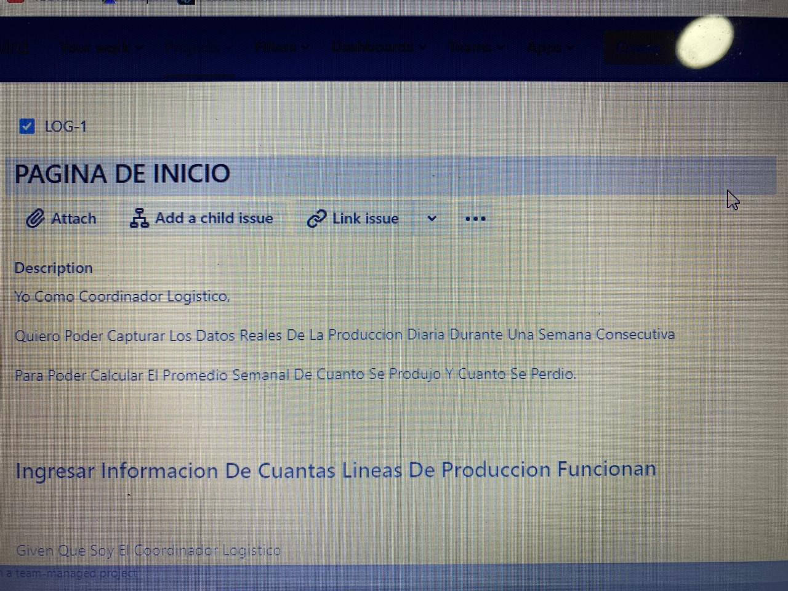
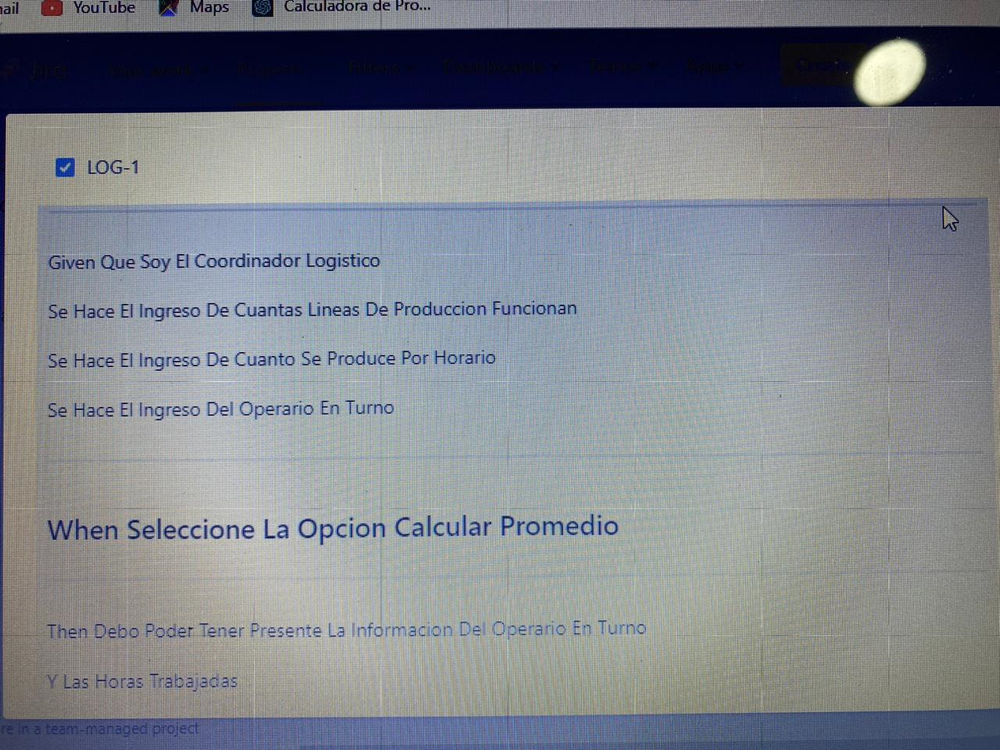
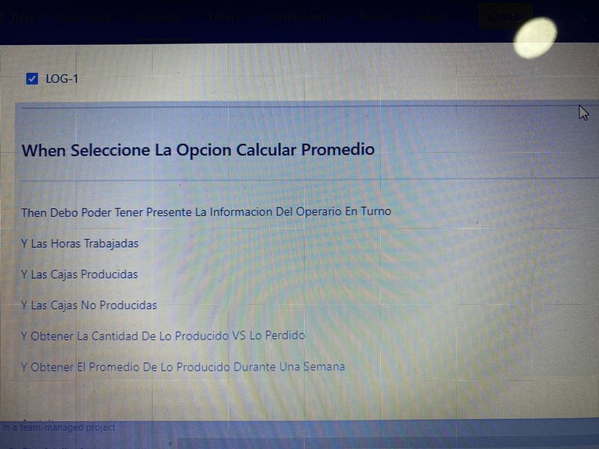
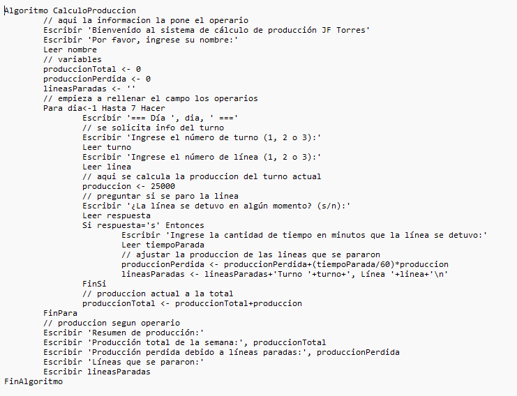

## **ESTE ES MI PROYECTO DE LOGISTICA**
------------------------------------------------------------------------------------------------------------------------------------------
------------------------------------------------------------------------------------------------------------------------------------------
En su labor como programador de software ha sido elegido para el desarrollo de una aplicación que
necesita un coordinador logistico de una planta de producción, que desea calcular la cantidad de cajas en las lineas de produccion en diferentes turnos.

La Produccion se divide en 3 turnos; turno 1= 6am a 2pm, turno 2= 2pm a 10pm, turno 3= 10pm a 6am. Cada linea de produccion por turno produce 25.000 cajas de manera continua.

Solicitar nombre de la persona a cargo, turno realizado y que linea trabajó

Solicitar informacion si se paro en algun momento la linea, cual linea, por cuanto tiempo se paro y hacer respectivo ajuste, finalmente calcular y mostrar en pantalla que lineas se pararon con su produccion perdida y total de produccion de una semana.

-----------------------------------------------------------------------------------------------------------------------------------------
-----------------------------------------------------------------------------------------------------------------------------------------

-----------------------------------------------------------------------------------------------------------------------------------------
-----------------------------------------------------------------------------------------------------------------------------------------

-----------------------------------------------------------------------------------------------------------------------------------------
-----------------------------------------------------------------------------------------------------------------------------------------

------------------------------------------------------------------------------------------------------------------------------------------
------------------------------------------------------------------------------------------------------------------------------------------

-----------------------------------------------------------------------------------------------------------------------------------------
-----------------------------------------------------------------------------------------------------------------------------------------
